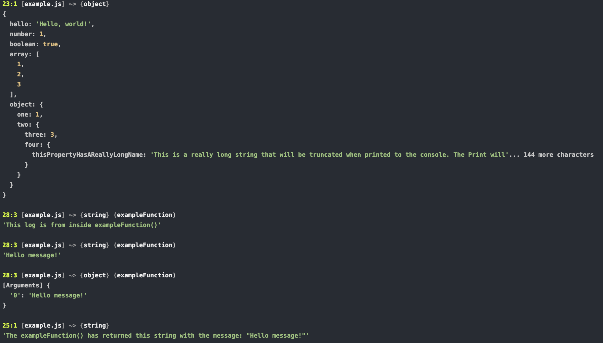

# dcsm-print

`dcsm-print` is a simple console.log wrapper that shows more information when logging.

## Installation

You can install `dcsm-print` using npm:

```bash
npm install dcsm-print
```

## Usage
To use `dcsm-print`, simply import it in your code and use it like you would use `console.log`:

```javascript
import Print from 'dcsm-print';

Print('Hello, world!');
```

### Or add `Print` to the `console`
Print supports beeing used as `console.print`:
  
```javascript
import Print from 'dcsm-print';
console.print = function() {
  Print(...arguments);
}
console.print('Hello, world!');
```


## Terminal output
_`Print` or `console.print` will display the `row`, `column`, `file`, `typeof` and `where/within/function` it was executed/used. <br />The output is also colorized using ANSI 256 color code's_

[<br />](./media/terminal-screenshot.png)
*A screenshot with a few examples of the output produced*